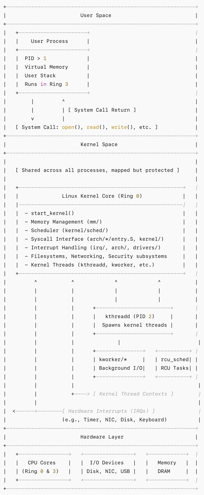

# 内核不是进程，而是系统。

Linux 内核既不是进程、守护进程，也不是应用程序。它是一个拥有特权的、常驻内存的环境，构成了操作系统的基础。与用户程序不同，它不会被调度，没有 PID，也不像普通任务那样被启动或停止。相反，它自系统启动即常驻内存，并负责管理硬件与软件之间的全部交互。

一旦被引导加载程序 `bootloader` 加载，内核便从 `start_kernel()` 开始执行，在该函数中完成内存管理、设备接口以及各个核心子系统的初始化。在完成这次一次性的初始化之后，内核并不会像普通独立任务那样持续运行。相反，内核成为一种响应式的执行层，只在需要时才被触发——用户进程、硬件事件或内部线程。

内核代码有 3 条主要的执行上下文：（1）用户进程发起的系统调用；（2）硬件触发的中断处理流程；以及（3）位于那些完全运行在内核态中的、长期存活的内核线程之内。这些线程由内核自身创建并管理，负责处理例如内存回收、I/O 调度以及同步机制等后台任务。尽管它们会出现在进程列表中——通常以方括号括起显示——但它们并不是用户态守护进程，也从不执行任何用户空间代码。

第一个这样的线程是 `kthreadd`, 进程号（PID）为 2。在函数 `rest_init()` 中初始化的最后阶段创建，它负责创建所有其他内核线程。就像 PID 1 (init 或 systemd) 标志着用户态的开端，PID 2 则标志着内核线程运行时的开端。

内核线程的数量不是固定的。在引导加载期间，系统可能会创建 20-40 个基本线程 — 每个内核一个用于软 IRQ、看门狗、迁移助手和早期工作队列。随着系统变得活跃，会根据 I/O 、内存管理、文件系统以及设备驱动的需要，创建更多的线程。在典型的现代 Linux 系统中，100-150 个内核线程可以同时运行，且会根据工作负载动态扩展。

尽管内核线程可见，但它们并不是独立的程序。内核本身不是运行的任务--它是一个始终存在的执行环境。它并不参与调度，而是以被调用的方式进入执行。它提供结构性组织、控制能力与特权机制，使所有任务能够运行，同时自身却不以任务的形式存在。

简而言之，内核并不是系统中的一个进程——它就是系统的核心。始终常驻，始终特权，始终掌控全局。

